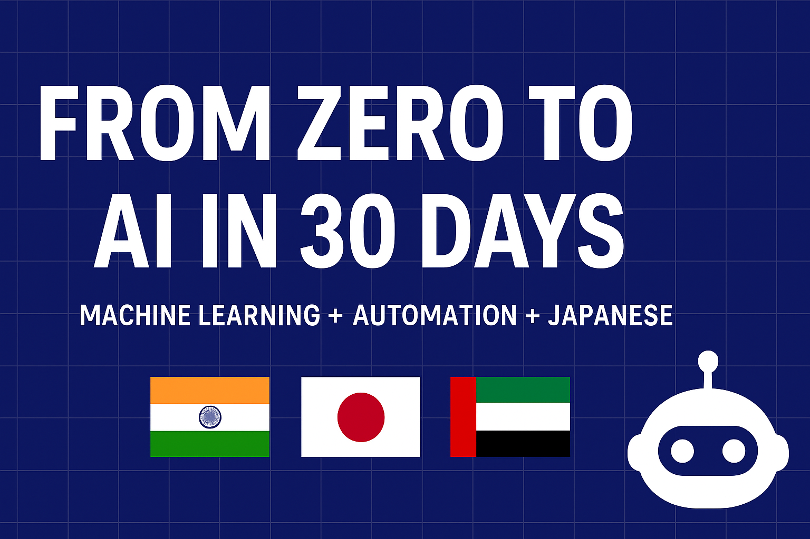

# 30Days-AI-ML-Challenge
Public build-in-public log: learning ML from scratch in 30 days + n8n automation + Japanese (N5/N4).

## Structure
- `assets/` — banners, screenshots, thumbnails
- `Day01..Day30/` — daily notebooks, data, outputs
- `docs/` — extra notes, write-ups
- `templates/` — README / notebook templates

## Daily Log
I’ll push one folder per day with:  
- `notebooks/` — Jupyter work  
- `data/` — sample datasets  
- `outputs/` — charts, predictions, reports
